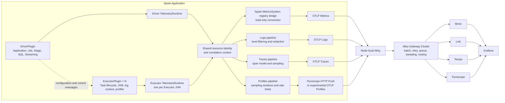

# Spark Unified Telemetry Plugin Architecture

Status: Draft  
Target: Apache Spark 3.0+  
Signals: Metrics, Logs, Traces, Profiles  
Transport model: Push

## 1. Purpose

This document defines the architecture of a Spark plugin that manages four observability signals:

- Metrics
- Logs
- Traces
- Continuous profiles

The plugin runs in both the Spark Driver and every Spark Executor. It generates consistent telemetry, correlates signals with shared resource identity and trace context, and asynchronously pushes data to a node-local Grafana Alloy instance.

The plugin does not connect directly to Mimir, Loki, Tempo, or Pyroscope. Alloy owns reliable delivery, backend authentication, routing, enrichment, and centralized policy.

## 2. Design principles

1. Spark execution must never depend on telemetry availability.
2. No network I/O is allowed on Spark task execution threads.
3. Each signal has an independent bounded queue and overload policy.
4. The Driver owns application-level semantics; Executors own process-local collection.
5. Executors push telemetry directly to Alloy instead of relaying it through the Driver.
6. Metrics, logs, traces, and profiles share resource identity but retain separate data models and transports.
7. Standard protocols are preferred over a custom four-signal envelope.
8. Backend secrets remain in Alloy and are never stored in `SparkConf`.
9. High-cardinality identifiers are excluded from metric dimensions.
10. Experimental profiling protocols are isolated behind a transport interface.

## 3. Scope

### 3.1 In scope

- Spark `DriverPlugin` and `ExecutorPlugin` lifecycle integration
- Application, job, stage, streaming-query, micro-batch, and sampled task telemetry
- Asynchronous push of metrics, logs, traces, and profiles
- Unified resource attributes and cross-signal correlation
- Batching, bounded queues, retry, circuit breaking, and graceful shutdown
- Node-local Alloy and centralized Alloy Gateway deployment
- Mimir, Loki, Tempo, and Pyroscope backends
- Plugin self-observability

### 3.2 Out of scope

- Replacing the Spark History Server
- Implementing an observability storage backend
- Full-fidelity tracing of every Spark task
- Storing backend credentials in the Spark application
- Providing exactly-once telemetry delivery
- Creating a proprietary four-signal network protocol
- Depending exclusively on the experimental OpenTelemetry Profiles protocol

## 4. System architecture



### 4.1 Control plane

The control plane distributes configuration and coordinates lifecycle state:

- The Driver initializes global configuration.
- `DriverPlugin.init()` returns immutable configuration to every Executor plugin.
- Spark plugin RPC may be used for lightweight control messages and acknowledgements.
- RPC is not used as the telemetry data path.
- Expensive work must not run in Driver initialization or shared Spark RPC threads.

### 4.2 Data plane

Each Driver or Executor JVM owns a `TelemetryRuntime`. The runtime writes signals to independent in-memory queues. Background workers batch and push the data to a node-local Alloy instance.

Executors never forward logs, traces, or profiles through the Driver. This avoids a Driver bottleneck and allows dynamic Executors to scale independently.

## 5. Plugin structure

```text
spark-telemetry-plugin
├── spark-plugin
│   ├── UnifiedTelemetryPlugin
│   ├── TelemetryDriverPlugin
│   └── TelemetryExecutorPlugin
├── spark-instrumentation
│   ├── SparkListenerAdapter
│   ├── QueryExecutionListenerAdapter
│   ├── StreamingQueryListenerAdapter
│   ├── TaskLifecycleAdapter
│   └── Log4j2ContextBridge
├── telemetry-runtime
│   ├── TelemetryRuntime
│   ├── ResourceIdentity
│   ├── CorrelationContext
│   ├── SparkMetricProducer
│   ├── LogPipeline
│   ├── TracePipeline
│   └── ProfilePipeline
├── transport
│   ├── OtlpMetricExporter
│   ├── OtlpLogExporter
│   ├── OtlpTraceExporter
│   ├── PyroscopeProfileExporter
│   └── OtlpProfileExporterExperimental
├── reliability
│   ├── BoundedSignalQueue
│   ├── BatchProcessor
│   ├── RetryPolicy
│   └── CircuitBreaker
└── config
    └── TelemetryConfig (Scala, Spark ConfigBuilder / ConfigEntry)
```

Dependencies should be shaded and relocated to avoid conflicts with Spark, Scala, Netty, gRPC, Guava, and application dependencies. Native profiling libraries should be packaged separately from the core plugin artifact.

## 6. Spark lifecycle integration

### 6.1 Driver responsibilities

The Driver plugin manages global application semantics:

- Initialize the Driver `TelemetryRuntime`.
- Establish application resource identity.
- Install Spark listeners after the Spark context is ready.
- Export the process-local Spark `MetricsSystem` registry without registering plugin metrics.
- Convert Spark events into application, job, stage, SQL, and streaming telemetry.
- Return validated Executor configuration from `DriverPlugin.init()`.
- Perform a bounded final flush during shutdown.

Driver initialization must remain lightweight because it blocks Spark Driver startup. Heavy initialization runs on plugin-owned background threads.

### 6.2 Executor responsibilities

Each Executor plugin manages local process signals:

- Initialize an Executor `TelemetryRuntime`.
- Establish Executor resource identity.
- Install task lifecycle hooks.
- Attach Spark identifiers to local logging context.
- Start or attach the configured profiler.
- Record task timing and failure events.
- Emit sampled task spans.
- Export Spark's process-local registry, including its JVM/runtime sources.
- Push directly to node-local Alloy.
- Perform a short bounded flush during Executor shutdown.

`onTaskStart`, `onTaskSucceeded`, and `onTaskFailed` execute on Spark task threads. Their implementations only create small event objects and call non-blocking `offer()` on a bounded queue. They must never serialize OTLP payloads or call a remote service.

## 7. Unified telemetry runtime

Each JVM owns one runtime:

```text
Event source
    ↓
Signal adapter
    ↓
Resource and context enrichment
    ↓
Filter / sampler / cardinality guard
    ↓
Independent bounded queue
    ↓
Background batch processor
    ↓
Exporter
    ↓
Node-local Alloy
```

The runtime provides:

- Shared immutable resource identity
- Per-thread correlation context
- Four independent signal pipelines
- Lifecycle-safe background workers
- Bounded memory usage
- Asynchronous batching and export
- Exporter health and drop counters
- Bounded shutdown flush

## 8. Resource identity

All signals use a shared resource model:

```text
service.name                 = spark-orders
service.namespace            = data-platform
service.instance.id          = <application-id>/<driver-or-executor-id>
deployment.environment.name  = production

spark.app.name               = orders-etl
spark.app.id                 = application-...
spark.role                   = driver | executor
spark.executor.id            = 12
spark.job.id                 = 40
spark.stage.id               = 91
spark.task.attempt.id        = 100003
```

The exact attribute set depends on the signal. Stable service and environment attributes are resource attributes; short-lived Spark identifiers are event, span, or log attributes.

### 8.1 Metric cardinality rules

Allowed metric dimensions include:

- `service.name`
- `spark.role`
- deployment environment
- cluster
- namespace
- outcome or status

The following values must not be metric dimensions:

- `spark.app.id`
- job ID
- stage ID
- task ID
- executor ID
- trace ID
- span ID

These high-cardinality identifiers belong in traces, structured log metadata, profile metadata with controlled retention, or metric exemplars.

## 9. Signal pipelines

### 9.1 Metrics

Metrics come exclusively from the process-local Spark `MetricsSystem#registry`. The plugin does not
create instruments or update metric state from Spark listener and task lifecycle callbacks. An OTel
`MetricProducer` reads the Dropwizard registry on each collection, so metrics registered by Spark at
runtime are discovered without a second registry or synchronization path.
Local mode shares one `MetricsSystem` between Driver and Executor plugin components, so only the
Driver runtime exports that registry.

Numeric gauges and decrementable Dropwizard counters are exported as gauges. Meter counts are
cumulative sums and rates are gauges. Histogram and timer counts are cumulative sums, while snapshot
statistics are gauges; timer durations are converted from nanoseconds to milliseconds. Unsupported
non-numeric gauges are skipped independently.

The transport is OTLP Metrics push to Alloy. Cumulative values retain process-lifetime start time and
the metric Resource identifies one JVM writer.

### 9.2 Logs

The plugin attaches a non-blocking OpenTelemetry-compatible Log4j2 appender or bridge while preserving existing Spark log outputs.

Log records include:

- Timestamp and observed timestamp
- Severity
- Logger name
- Message body
- Exception type, message, and stack trace
- Resource identity
- Spark execution identifiers
- Active trace and span IDs

The log exporter must exclude its own internal logger namespaces to prevent recursive logging. Under pressure, DEBUG and INFO records are dropped before WARN and ERROR records.

### 9.3 Traces

#### Batch applications

```text
Application span
├── Job span
│   ├── Stage span
│   └── Stage span
└── Job span
```

Spark stages form a DAG. When a stage has multiple causal dependencies, span links are preferred over fabricated parent-child relationships.

#### Structured Streaming

An unbounded streaming query must not produce a single unbounded trace. Each micro-batch creates a separate trace:

```text
Streaming query
├── Micro-batch 1001 trace
├── Micro-batch 1002 trace
└── Micro-batch 1003 trace
```

#### Task sampling

Default task policy:

- Failed tasks: retain 100%
- Tasks exceeding the slow threshold: retain 100%
- Normal successful tasks: sample between 0.1% and 1%

Creating one retained span for every task is prohibited by default because large jobs can produce millions of tasks.

### 9.4 Profiles

The profile pipeline is transport-pluggable:

```java
public interface ProfileExporter {
    ExportResult export(ProfileBatch batch);
}
```

Production default:

- Java/JFR, async-profiler, or Pyroscope-compatible collection
- Push to Alloy `pyroscope.receive_http`
- Alloy forwards through `pyroscope.write`

Experimental option:

- OTLP Profiles exporter behind an explicit feature flag
- No persistent compatibility guarantee while the protocol remains in development

Profile data uses a lower-priority queue. When overloaded, the plugin reduces the sampling rate or skips a profile window rather than consuming unbounded memory.

## 10. Push protocols

| Signal | Plugin to Alloy | Alloy to backend |
|---|---|---|
| Metrics | OTLP HTTP/Protobuf or gRPC | OTLP or Prometheus remote write to Mimir |
| Logs | OTLP HTTP/Protobuf or gRPC | OTLP/Loki ingestion to Loki |
| Traces | OTLP HTTP/Protobuf or gRPC | OTLP to Tempo |
| Profiles | Pyroscope HTTP Push | Pyroscope write to Pyroscope |

Metrics, logs, and traces may share one OTLP endpoint. Profiles use a separate logical endpoint until OTLP Profiles is sufficiently mature.

No custom four-signal envelope is introduced.

## 11. Reliability and backpressure

### 11.1 Independent queues

| Pipeline | Queue behavior | Overload behavior |
|---|---|---|
| Metrics | Aggregate and coalesce | Coalesce gauges; count rejected updates |
| Logs | Severity-aware queue | Drop DEBUG/INFO before WARN/ERROR |
| Traces | Sampling-aware queue | Drop normal successful traces before errors |
| Profiles | Window-oriented queue | Lower sampling frequency or skip a window |

Independent queues prevent log or profile bursts from blocking metrics and traces.

### 11.2 Retry

Exporters use:

- Exponential backoff
- Jitter
- Maximum elapsed retry time
- Per-request timeout
- Circuit breaker
- Maximum telemetry age

Retry happens only on background threads. Non-retryable protocol errors are counted and dropped.

### 11.3 Delivery semantics

The plugin provides best-effort at-least-once delivery while a batch remains in memory. Exactly-once delivery is not a goal. Duplicate telemetry must be tolerated by downstream systems.

Disk-backed durability belongs in Alloy rather than the Spark plugin. This keeps Executor local state small and avoids task interference from disk I/O.

### 11.4 Shutdown

- Stop accepting new events.
- Signal background workers.
- Flush within `spark.telemetry.shutdown.flush-timeout`.
- Drop remaining data when the deadline expires.
- Never prevent Driver or Executor shutdown indefinitely.

## 12. Alloy deployment

### 12.1 Edge Alloy

Run Alloy close to each Spark process:

- Kubernetes: one DaemonSet instance per node
- YARN or standalone: one Alloy process per Worker host
- Development: one local Alloy process

Responsibilities:

- Receive OTLP and Pyroscope Push traffic
- Add Kubernetes, host, cloud, and cluster metadata
- Perform initial batching and memory limiting
- Redact sensitive fields
- Forward to the centralized Gateway

Endpoint discovery:

```text
Standalone or YARN: http://127.0.0.1:4318
Kubernetes:          http://<node-host-ip>:4318
Profiles:            http://<node-local-alloy>:9999
```

In Kubernetes, the plugin can read a Downward API-provided host IP and construct the node-local endpoint. A sidecar is supported but is not the default because Spark may create many short-lived Executor Pods.

### 12.2 Alloy Gateway

Run multiple centralized Gateway replicas. Responsibilities include:

- mTLS and backend credentials
- Centralized batch and retry policies
- Persistent sending queues where supported
- Tail sampling
- Multi-tenant routing
- Rate limiting
- Centralized redaction
- Backend failure isolation

Routing requirements:

- Tail sampling requires trace-affinity routing.
- Service graph and span-metrics generation require consistent routing by trace ID or service.
- Prometheus remote-write traffic requires consistent series routing to avoid out-of-order samples.
- Profiles can be load-balanced, subject to receiver connection limits and timeout configuration.

## 13. Security

- Backend tokens, tenant identifiers, and TLS private keys are stored only in Alloy.
- Secrets must not be placed in `SparkConf`, because Spark UI and event logs can expose configuration values.
- Plugin-to-edge traffic is restricted to node-local network paths.
- Edge-to-Gateway and Gateway-to-backend traffic uses mTLS where possible.
- Logs are redacted before leaving the node.
- Attribute allowlists prevent accidental transmission of credentials or personally identifiable information.
- Profile collection is disabled by default in environments where source names or stack data are considered sensitive.

## 14. Configuration model

Example Spark configuration:

```properties
spark.plugins=com.example.spark.telemetry.UnifiedTelemetryPlugin

spark.telemetry.enabled=true
spark.telemetry.endpoint=http://node-alloy:4318
spark.telemetry.profile.endpoint=http://node-alloy:9999

spark.telemetry.metrics.enabled=true
spark.telemetry.logs.enabled=true
spark.telemetry.traces.enabled=true
spark.telemetry.profiles.enabled=true

spark.telemetry.traces.task.sample-rate=0.01
spark.telemetry.traces.slow-task-threshold=30s
spark.telemetry.logs.minimum-level=INFO
spark.telemetry.profiles.sample-rate=19
spark.telemetry.profiles.transport=pyroscope

spark.telemetry.queue.metrics.capacity=1000
spark.telemetry.queue.logs.capacity=10000
spark.telemetry.queue.traces.capacity=5000
spark.telemetry.queue.profiles.capacity=10

spark.telemetry.batch.max-size=512
spark.telemetry.batch.timeout=2s
spark.telemetry.shutdown.flush-timeout=3s
```

Configuration precedence:

1. Administrative defaults packaged with the plugin
2. Environment variables
3. Spark configuration
4. Driver-validated immutable Executor configuration

Secrets are deliberately excluded from this model.

## 15. Plugin self-observability

The plugin does not register self-metrics because metrics export is intentionally limited to entries
owned by Spark's `MetricsSystem` registry. Exporter health is observed at Alloy and through
rate-limited plugin logs, which must be excluded from recursive export by the log bridge.

## 16. Failure model

| Failure | Expected behavior |
|---|---|
| Alloy unavailable | Queue, retry asynchronously, then drop at configured limits |
| Backend unavailable | Alloy absorbs retries; plugin remains unaware where possible |
| Queue full | Apply the signal-specific overload policy |
| Serialization failure | Count and drop the affected item |
| Invalid configuration | Disable the affected signal or fail plugin initialization according to strictness mode |
| Profiler unavailable | Disable profiles and continue Spark execution |
| Plugin callback exception | Catch, count, and suppress unless initialization strictness requires failure |
| Executor killed | Accept possible loss of the final in-memory batches |
| Driver killed | Executors continue local export until they terminate |

The default strictness is fail-open: telemetry failure does not fail the Spark workload.

## 17. Testing strategy

### 17.1 Unit tests

- Resource and attribute mapping
- Cardinality allowlists
- Trace hierarchy and span links
- Queue overflow policies
- Retry classification
- Configuration validation
- Shutdown deadlines
- Log recursion prevention

### 17.2 Compatibility tests

- Supported Spark minor versions
- Scala binary versions used by supported Spark distributions
- Java 8, 11, 17, and newer versions as required by the Spark target matrix
- Kubernetes, YARN, and standalone cluster managers
- Dynamic allocation and Executor churn
- Batch and Structured Streaming workloads

### 17.3 Load tests

- Millions of task lifecycle events
- Log bursts
- Slow and unavailable Alloy endpoints
- Queue saturation
- High Executor churn
- Long-running streaming applications
- Profile overhead at configured sampling rates

Acceptance requirements:

- No network calls on task threads
- Bounded plugin heap usage
- Negligible impact when telemetry is healthy
- Controlled degradation when telemetry is unavailable
- No Spark job failure caused by exporter errors

### 17.4 End-to-end tests

Use a local stack containing:

- Spark
- Alloy Edge
- Alloy Gateway
- Mimir or Prometheus
- Loki
- Tempo
- Pyroscope
- Grafana

Tests verify cross-signal navigation from a metric exemplar to a trace, from a span to logs, and from a span or service instance to a profile.

## 18. Delivery plan

### Phase 1: Core MVP

- Driver and Executor plugin lifecycle
- Shared resource identity
- Driver application/job/stage events
- Sampled Executor task traces
- OTLP metrics, logs, and traces
- Pyroscope profile push
- Independent bounded queues
- Basic self-observability

### Phase 2: Production hardening

- Structured Streaming and SQL listeners
- Cardinality enforcement
- Severity-aware log shedding
- Error- and latency-aware trace sampling
- Alloy Gateway high availability
- Security hardening and redaction
- Load and compatibility test suite

### Phase 3: Advanced capabilities

- Dynamic remote configuration
- Adaptive task sampling
- Profile-to-span correlation
- Optional disk-backed edge durability in Alloy
- Multi-tenant routing
- Experimental OTLP Profiles exporter

## 19. Architecture decisions

### ADR-001: Executors push directly to Alloy

Accepted. Relaying all Executor telemetry through the Driver creates a bottleneck and a single failure domain.

### ADR-002: Four independent queues

Accepted. Different signals have different volumes, priorities, and overload behavior. A shared queue creates head-of-line blocking.

### ADR-003: No custom unified transport

Accepted. Metrics, logs, and traces use OTLP; profiles use the production-ready Pyroscope push path until OTLP Profiles matures.

### ADR-004: No synchronous export in Spark callbacks

Accepted. Spark task hooks must remain lightweight and must not call remote services.

### ADR-005: Task spans are sampled

Accepted. Full task tracing creates unacceptable cardinality and storage volume for large workloads.

### ADR-006: Alloy owns secrets and durable transport

Accepted. Spark configuration is not an appropriate secret store, and plugin-local disk queues would interfere with workload resources.

## 20. References

- [Apache Spark `SparkPlugin` API](https://spark.apache.org/docs/latest/api/java/org/apache/spark/api/plugin/SparkPlugin.html)
- [Apache Spark `DriverPlugin` API](https://spark.apache.org/docs/latest/api/java/org/apache/spark/api/plugin/DriverPlugin.html)
- [Apache Spark `ExecutorPlugin` API](https://spark.apache.org/docs/latest/api/java/org/apache/spark/api/plugin/ExecutorPlugin.html)
- [Grafana Alloy architecture](https://grafana.com/docs/alloy/latest/introduction/how-alloy-works/)
- [Grafana Alloy proxy and aggregation patterns](https://grafana.com/docs/alloy/latest/configure/proxy/)
- [Grafana Alloy profile receiver](https://grafana.com/docs/pyroscope/latest/configure-client/grafana-alloy/receive_profiles/)
- [OpenTelemetry Profiles specification](https://opentelemetry.io/docs/specs/otel/profiles/)
- [OpenTelemetry Protocol specification](https://github.com/open-telemetry/opentelemetry-proto/blob/main/docs/specification.md)
- [OpenTelemetry Collector exporter helper](https://go.opentelemetry.io/collector/exporter/exporterhelper)
